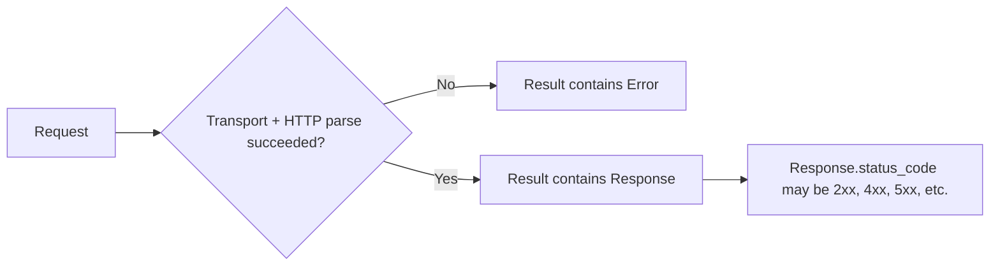
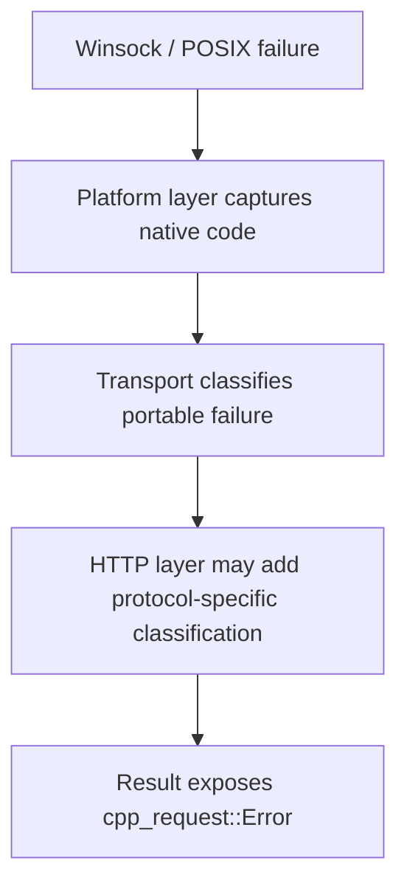

# Error Model

## Status

- Project: `cpp_request`
- Target release: MVP v1.0
- Status: Proposed v1 contract
- Language baseline: C++17

## Goals

The v1 error model is designed to be:

1. **Structured** — callers branch on stable library-owned codes, not diagnostic strings.
2. **Non-exception-based** — expected URL, DNS, socket, timeout, and protocol failures are returned through `Result<T>`.
3. **Portable** — Winsock and POSIX errors are normalized before reaching public API consumers.
4. **Lightweight** — error objects do not require heap allocation for normal reporting.
5. **Diagnostic-friendly** — native OS error values may be retained as secondary information.

## Public Error Shape

The public contract should conceptually expose:

```cpp
enum class ErrorCode {
    InvalidUrl,
    UnsupportedScheme,
    InvalidPort,

    ResolveFailed,
    SocketCreateFailed,
    ConnectFailed,
    ConnectTimeout,
    WriteFailed,
    WriteTimeout,
    ReadFailed,
    ReadTimeout,
    ConnectionClosed,

    MalformedResponse,
    InvalidStatusLine,
    InvalidHeader,
    InvalidContentLength,
    InvalidChunkSize,
    InvalidChunkFraming,
    ConflictingMessageFraming,
    UnexpectedEof,
    ResponseLimitExceeded,

    RedirectLimitExceeded,
    MissingRedirectLocation,
    UnsupportedRedirectScheme,

    Unknown
};

struct Error {
    ErrorCode code;
    int native_code;
};
```

The exact physical representation may change during implementation, but the semantic contract above is frozen for v1 unless implementation proves a concrete correctness issue.

## `native_code`

`native_code` is optional diagnostic metadata encoded as an integer-compatible value.

Rules:

- `0` means no native diagnostic is attached.
- POSIX errors may preserve `errno`.
- Windows errors may preserve the result of `WSAGetLastError()` or an equivalent native code.
- callers must not use `native_code` as the primary portable error contract.
- library behavior must branch on `ErrorCode`, not platform-native numbers.

## Error Categories

### URL / input errors

| Code | Meaning |
| --- | --- |
| `InvalidUrl` | URL syntax cannot be accepted by the v1 parser. |
| `UnsupportedScheme` | URL uses a scheme unsupported by v1, including `https`. |
| `InvalidPort` | Explicit port is syntactically invalid or outside the accepted range. |

### Resolution / socket / transport errors

| Code | Meaning |
| --- | --- |
| `ResolveFailed` | Hostname or service resolution failed. |
| `SocketCreateFailed` | A native socket could not be created. |
| `ConnectFailed` | TCP connection establishment failed for reasons other than timeout. |
| `ConnectTimeout` | Connection establishment exceeded the configured connect timeout. |
| `WriteFailed` | Request bytes could not be sent completely for reasons other than timeout. |
| `WriteTimeout` | Request transmission exceeded the configured write timeout. |
| `ReadFailed` | Response bytes could not be read for reasons other than timeout or clean peer closure. |
| `ReadTimeout` | Waiting for response bytes exceeded the configured read timeout. |
| `ConnectionClosed` | Peer closure is observed where the operation requires an active connection. |

### HTTP protocol / response errors

| Code | Meaning |
| --- | --- |
| `MalformedResponse` | Response violates HTTP syntax but does not fit a more specific code. |
| `InvalidStatusLine` | HTTP status line is malformed or unsupported. |
| `InvalidHeader` | Header field syntax is invalid for accepted v1 parsing rules. |
| `InvalidContentLength` | `Content-Length` is malformed, invalid, or otherwise unusable. |
| `InvalidChunkSize` | Chunk-size line is invalid. |
| `InvalidChunkFraming` | Chunk delimiters, CRLF, or terminal framing are invalid. |
| `ConflictingMessageFraming` | Response framing metadata is contradictory or unsafe to interpret silently. |
| `UnexpectedEof` | Connection ended before protocol-defined response completion. |
| `ResponseLimitExceeded` | Response parsing would exceed a configured response-head, decoded-body, chunk-line, or trailer resource limit. |

`ResponseLimitExceeded` is intentionally separate from syntax errors: a response may be syntactically valid but exceed the caller's configured in-memory resource budget.

### Redirect errors

| Code | Meaning |
| --- | --- |
| `RedirectLimitExceeded` | Configured redirect count was exceeded. |
| `MissingRedirectLocation` | A followed redirect requires `Location`, but no usable target exists. |
| `UnsupportedRedirectScheme` | Redirect target requires an unsupported scheme/transport. |

### Fallback

`Unknown` is reserved for failures that cannot yet be classified safely. New implementation paths should prefer a specific stable code whenever practical.

## HTTP Status Codes Are Not Library Errors

An HTTP response such as `404`, `500`, or `503` is still a successfully received HTTP response.



The library must not convert HTTP status codes into `ErrorCode` values automatically.

This separation allows callers to distinguish:

- failure to communicate or parse the response, versus
- a valid HTTP response whose application-level status indicates failure.

## Error Propagation Across Layers



Rules:

- platform-specific numeric values never replace `ErrorCode`.
- lower-layer failures should not be reclassified unless the upper layer has additional semantic information.
- errors must preserve the most specific meaningful portable classification available.

## Timeout Classification

Timeouts remain distinct by operation:

- `ConnectTimeout`
- `ReadTimeout`
- `WriteTimeout`

They must not collapse into one generic timeout code in v1 because callers may need different recovery/logging behavior for each stage.

## EOF Semantics

EOF handling depends on HTTP framing context.

Examples:

- EOF while reading a `Content-Length` body before all declared bytes arrive → `UnexpectedEof`.
- EOF before a complete chunked message terminator → `UnexpectedEof` or a more specific chunk framing error.
- EOF after a valid close-delimited response body → normal message completion, not an error.
- EOF when a reusable connection is expected but no request is currently active may simply invalidate reuse state internally.

## Resource-limit semantics

Response resource limits are described in `response-limits.md`.

Exceeding a configured limit:

- returns `ResponseLimitExceeded`,
- does not become `MalformedResponse`,
- does not produce a partial successful `Response`,
- does not leave the active connection eligible for reuse.

## Diagnostic Message Function

The library may expose a lightweight function such as:

```cpp
std::string_view error_message(ErrorCode code) noexcept;
```

Requirements:

- returns static/non-owning text,
- performs no heap allocation,
- messages are for diagnostics only,
- callers must not parse message text to determine behavior.

## Exception Policy

Expected runtime failures represented by this document must not require exceptions.

The v1 contract does not require a global `noexcept` guarantee for every public function, because standard-library allocation may still fail. However, network/protocol error reporting itself must use `Result<T>` rather than throwing library-specific exceptions.
