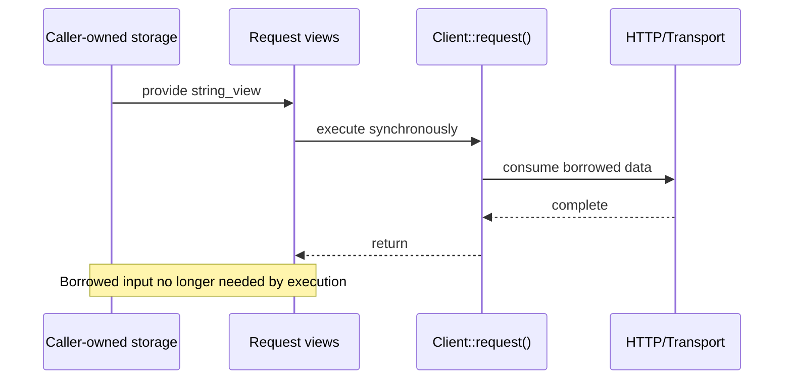

# Lifetime and Ownership Contract

## Status

- Project: `cpp_request`
- Target release: MVP v1.0
- Status: Frozen v1.0 contract
- Language baseline: C++17

This document defines the stable ownership and lifetime rules for public API data, especially where `std::string_view` is used.

---

## Core Principle

`std::string_view` is a non-owning view. It must never outlive the storage it references.

The v1 API uses views only when borrowing is explicit and bounded by synchronous execution.

Ownership remains with the object or caller that owns the underlying storage.

---

## Request-Side Lifetime

### URL input

When a request is created from `std::string_view`, the underlying URL storage must remain valid for as long as the request object may read from that view.

Example:

```cpp
std::string url = "http://example.com/data";
cpp_request::Request req{cpp_request::Method::Get, url};

client.request(req); // valid: url still exists
```

Invalid pattern:

```cpp
cpp_request::Request req{
    cpp_request::Method::Get,
    std::string{"http://example.com/data"}
};
```

`Request` stores the supplied view directly, so a temporary string would be destroyed immediately and leave the view dangling.

Callers must keep borrowed URL storage alive while the `Request` may read it.

### Request body

If request body is provided as `std::string_view`, its backing storage must remain valid until synchronous request execution has finished consuming the body.

Because v1 request execution is synchronous, the library does not retain the body view after `Client::request(...)` returns.

### Request headers

`Headers` owns inserted header names and values. After `Headers::add()` or `Headers::set()` returns successfully, the caller does not need to keep the source header strings alive.

This allows temporary values to be used safely when constructing headers while keeping `std::string_view` primarily as an input parameter optimization.

---

## Response-Side Lifetime

`Response` owns its completed response body and the storage required to expose stable response metadata.

A `std::string_view` returned from a `Response` accessor remains valid only while:

- the owning `Response` remains alive,
- the owning `Response` has not been moved from in a way that invalidates the referenced storage,
- the referenced internal storage has not been mutated or replaced.

Example:

```cpp
auto result = client.get("http://example.com");
if (result) {
    auto& response = result.value();
    std::string_view body = response.body();
    // body is valid while response owns the storage
}
```

Views into a destroyed response are invalid.

---

## `Url` Lifetime

A parsed `Url` owns normalized URL storage internally and exposes stable component views for the lifetime of the `Url` object.

The public contract is:

- component views returned by a `Url` object remain valid while that `Url` object remains alive and unmodified,
- implementation details of that storage are not part of the public ABI contract.

---

## `Headers` Lifetime

`Headers` owns header names and values that have been inserted into it.

Views returned from header lookup remain valid until the corresponding `Headers` object is mutated in a way that can invalidate internal storage or until it is destroyed.

Iteration/reference invalidation follows the owning container's mutation behavior and should be treated conservatively by callers.

---

## Move Semantics

Resource-owning or storage-owning public types support efficient move semantics where appropriate.

After moving from an object:

- the moved-from object remains valid but its content is unspecified unless otherwise documented,
- any `std::string_view` that pointed into storage transferred by the move must not be assumed to remain valid unless explicitly guaranteed.

The conservative v1 rule is:

> Moving an owning object may invalidate views into that object.

This keeps the contract simple and avoids binding the API to container-specific move guarantees.

---

## Copy Semantics

Value-oriented types that own ordinary data are copyable where their declarations allow it.

Native socket ownership is never duplicated by copy.

The stable v1 rules are:

- `Client`: non-copyable and movable,
- internal socket owners: non-copyable and movable,
- `Response`: ordinary owning value type according to its generated special members,
- `Headers`: owning value type,
- `Url`: owning value type.

The declarations in the installed public headers are authoritative for exact special-member availability.

---

## Synchronous Boundary

The v1 synchronous execution model is central to the borrowing strategy.



The library does not retain request-side borrowed views for asynchronous work after the synchronous call returns.

---

## Invalid Lifetime Patterns

The following are explicitly unsafe:

- constructing a stored `Request` view from a temporary `std::string`,
- storing a response-derived view after destroying the `Response`,
- using a header lookup view after mutating `Headers` in a way that invalidates storage,
- assuming views survive moves of their owning objects.

---

## Design Rationale

The v1 lifetime model intentionally balances performance and implementation complexity:

- `std::string_view` avoids unnecessary copies for request inputs,
- synchronous execution bounds how long borrowed request data is needed,
- response data remains owned for safe user access,
- ownership-heavy structures such as headers copy at construction time where lifetime safety is more valuable than micro-optimizing tiny strings,
- no custom string-view implementation is required because C++17 is the project baseline.
