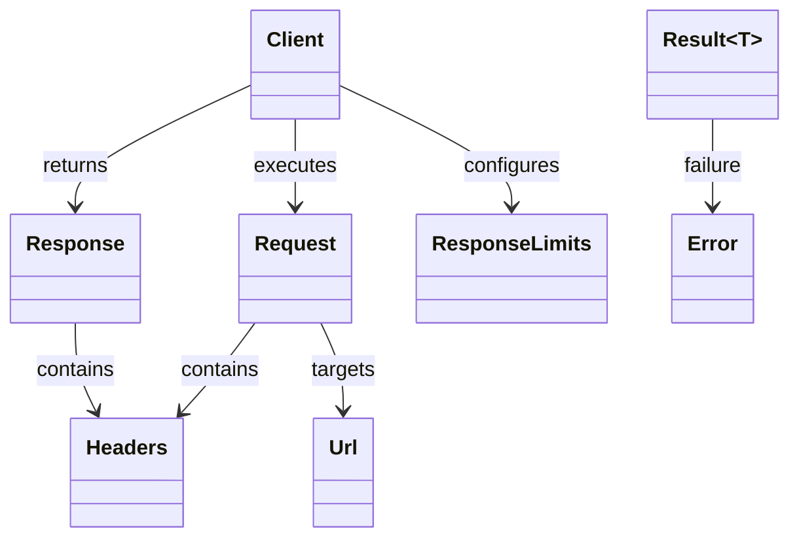
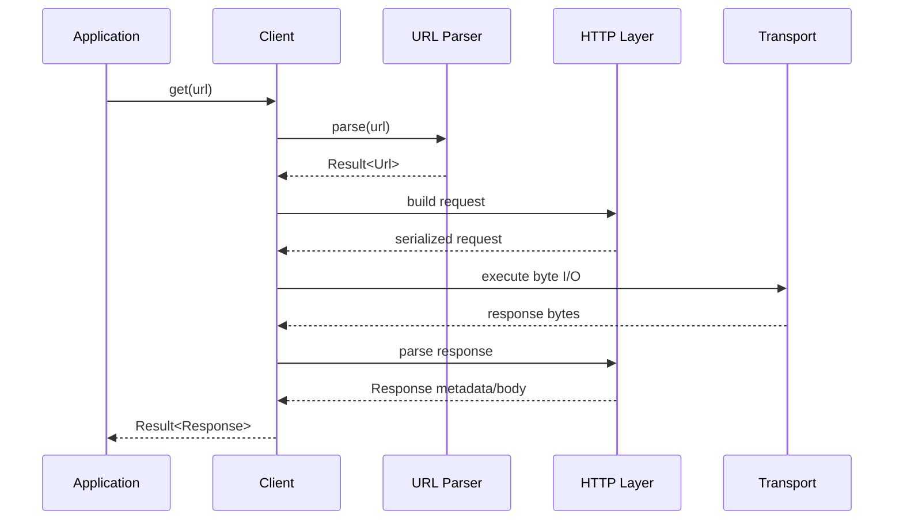

# Public API Contract

## Status

- Project: `cpp_request`
- Target release: MVP v1.0
- Status: Proposed API baseline
- Language baseline: C++17
- Namespace: `cpp_request`

This document defines the intended public API shape for v1.0. Internal implementation details remain free to change as long as the documented behavior is preserved.

## Design Principles

The public API should be:

1. small,
2. explicit,
3. lightweight,
4. synchronous,
5. non-exception-oriented for expected failures,
6. efficient for string-heavy HTTP processing.

`std::string_view` is preferred for non-owning textual input where the synchronous lifetime boundary makes borrowing safe and obvious.

---

## Core Public Types

The v1 public surface consists primarily of:

- `Client`
- `Request`
- `Response`
- `ResponseLimits`
- `Headers`
- `Url`
- `Error`
- `Result<T>`

Supporting configuration types may be introduced when they materially improve clarity, but the v1 API should avoid unnecessary wrappers.



---

## `Client`

`Client` is the primary stateful request executor.

Responsibilities:

- retain reusable connection state,
- retain client-level timeout configuration,
- retain redirect configuration,
- retain response resource-limit configuration,
- execute sequential HTTP requests,
- expose convenience member functions for common methods.

Conceptual interface:

```cpp
namespace cpp_request {

struct ResponseLimits {
    std::size_t max_head_bytes;
    std::size_t max_body_bytes;
    std::size_t max_chunk_line_bytes;
    std::size_t max_trailer_bytes;
};

class Client {
public:
    Client();

    Result<Response> request(const Request& request);

    Result<Response> get(std::string_view url);
    Result<Response> head(std::string_view url);
    Result<Response> post(std::string_view url, std::string_view body = {});
    Result<Response> put(std::string_view url, std::string_view body = {});
    Result<Response> patch(std::string_view url, std::string_view body = {});
    Result<Response> del(std::string_view url);

    void set_connect_timeout(std::chrono::milliseconds timeout);
    void set_read_timeout(std::chrono::milliseconds timeout);
    void set_write_timeout(std::chrono::milliseconds timeout);

    void set_follow_redirects(bool enabled);
    void set_max_redirects(std::size_t count);

    void set_response_limits(ResponseLimits limits) noexcept;
    const ResponseLimits& response_limits() const noexcept;
};

} // namespace cpp_request
```

Exact overload count may change before implementation, but the behavioral contract above is the v1 target.

### Thread safety

A single `Client` instance is **not** guaranteed to be safe for concurrent use from multiple threads in v1.0.

Independent `Client` instances may be used from different threads, subject to normal platform constraints.

### Redirect behavior

Automatic redirect following is enabled by default with a finite default limit of **10 followed redirects**. Callers may disable following with `set_follow_redirects(false)` or replace the limit with `set_max_redirects()`.

The v1 method/body policy is:

- `301` and `302`: `POST` becomes `GET` and its body is dropped; other methods are preserved,
- `303`: every method except `HEAD` becomes `GET`; the body is dropped,
- `307` and `308`: method and body are preserved.

When a body is dropped, body-specific request headers such as `Content-Length`, `Transfer-Encoding`, and `Content-Type` are not forwarded to the redirected request.

Relative `Location` values are resolved against the current effective request URL, including query parameters appended through `Request::add_query_param()`, and including absolute-path, relative-path, query-only, fragment-only, and scheme-relative forms. URL fragments are never sent in the HTTP request target.

Cross-origin redirects do not forward caller-supplied `Host`, `Authorization`, `Proxy-Authorization`, or `Cookie` fields. Once these fields are removed during a redirect chain they are not automatically restored if a later hop returns to the original origin.

Redirects requiring HTTPS/TLS or another unsupported scheme fail with a structured redirect error rather than being followed.

### Response resource limits

Because v1 responses are fully memory-resident, `Client` applies finite response parsing limits by default:

- response head: 64 KiB,
- decoded body: 64 MiB,
- chunk-size line: 8 KiB,
- chunked trailer section: 64 KiB.

Callers may replace the full configuration with `set_response_limits()`. Exceeding a configured limit returns `ErrorCode::ResponseLimitExceeded` and the active connection is not retained for reuse.

Zero is a real limit rather than an unlimited sentinel. Full enforcement details are defined in `response-limits.md`.

---

## `Request`

`Request` represents a complete logical HTTP request description before execution.

Conceptual interface:

```cpp
namespace cpp_request {

enum class Method {
    Get,
    Head,
    Post,
    Put,
    Patch,
    Delete
};

class Request {
public:
    struct QueryParam {
        std::string name;
        std::string value;
    };

    Request(Method method, std::string_view url);

    Method method() const noexcept;
    std::string_view url() const noexcept;

    Headers& headers() noexcept;
    const Headers& headers() const noexcept;

    void set_body(std::string_view body) noexcept;
    std::string_view body() const noexcept;

    void add_query_param(std::string_view name, std::string_view value);
    const std::vector<QueryParam>& query_params() const noexcept;
};

} // namespace cpp_request
```

### Borrowed and owned request data

The base URL and body may remain non-owning views. Their lifetime requirements are defined in `lifetime.md`.

Headers and query parameters added through the request object own their copied text independently from the caller's source buffers.

The v1 design does not require request-body ownership or request streaming.

### Query parameter behavior

`add_query_param(name, value)` appends one parameter in insertion order. Repeated names are preserved rather than deduplicated.

For request serialization:

- an existing raw query already present in the URL is preserved,
- appended parameters are added after that raw query,
- parameter names and values are percent-encoded byte-for-byte,
- URI unreserved bytes (`ALPHA`, `DIGIT`, `-`, `.`, `_`, `~`) remain unescaped,
- spaces are encoded as `%20`, not `+`,
- reserved characters such as `/`, `?`, `&`, and `=` are encoded inside appended names/values,
- UTF-8 input is percent-encoded by its UTF-8 bytes,
- repeated parameters preserve insertion order.

The raw URL parser does not silently repair malformed percent escapes. A raw path or query containing `%` must contain a complete `%HH` escape using hexadecimal digits.

---

## `Response`

`Response` represents a completed HTTP response.

The response owns its body because v1 only exposes completed in-memory responses.

Conceptual interface:

```cpp
namespace cpp_request {

class Response {
public:
    int status_code() const noexcept;
    std::string_view reason() const noexcept;

    const Headers& headers() const noexcept;

    std::string_view body() const noexcept;
    const std::string& body_storage() const noexcept;
};

} // namespace cpp_request
```

The exact body accessor names are not frozen by this document, but the following behavior is:

- completed response body is owned by `Response`,
- callers can access it without copying,
- destroying or moving-from the owning `Response` invalidates views into its owned storage.

---

## `Headers`

`Headers` represents HTTP header fields while preserving duplicate fields where needed.

Required behavior:

- insertion of multiple fields,
- case-insensitive lookup by field name,
- preservation of duplicate field values,
- efficient iteration,
- no requirement to canonicalize original field-name casing.

Conceptual API:

```cpp
namespace cpp_request {

class Headers {
public:
    void add(std::string_view name, std::string_view value);
    void set(std::string_view name, std::string_view value);
    bool contains(std::string_view name) const noexcept;

    std::string_view get(std::string_view name) const noexcept;
};

} // namespace cpp_request
```

### Lookup semantics

For v1:

- `get(name)` returns the first matching field value,
- absence is represented by an empty view,
- APIs for enumerating all duplicate values may be added if required by implementation/tests without breaking this base contract.

---

## `Url`

`Url` represents a parsed HTTP URL.

Required observable components:

- scheme,
- host,
- optional explicit port,
- effective port,
- path,
- query,
- request target.

Conceptual interface:

```cpp
namespace cpp_request {

class Url {
public:
    static Result<Url> parse(std::string_view input);

    std::string_view scheme() const noexcept;
    std::string_view host() const noexcept;
    std::string_view path() const noexcept;
    std::string_view query() const noexcept;

    std::uint16_t port() const noexcept;
    std::string_view target() const noexcept;
};

} // namespace cpp_request
```

For v1, only `http://` is supported. `https://` must fail explicitly.

Raw path/query percent escapes must be syntactically complete `%HH` sequences. Bracketed hosts are accepted only when they contain a valid numeric IPv6 literal. IPv6 zone identifiers are not part of the v1 URL contract.

Implementation may own normalized URL storage internally when necessary; callers must not depend on the exact storage representation.

---

## `Result<T>`

Expected runtime failures are returned through `Result<T>` rather than requiring exceptions.

Required semantic states:

- success with `T`,
- failure with `Error`.

Conceptual interface:

```cpp
namespace cpp_request {

template <class T>
class Result {
public:
    bool has_value() const noexcept;
    explicit operator bool() const noexcept;

    T& value();
    const T& value() const;

    Error error() const noexcept;
};

} // namespace cpp_request
```

The internal representation is intentionally not frozen here.

`Result<T>` must not require heap allocation solely to represent success/failure state when avoidable.

---

## `Error`

`Error` is a library-owned structured error value.

The exact taxonomy is intentionally deferred to the dedicated error-model document.

The public contract requires that callers can distinguish major failure classes without parsing diagnostic strings.

Expected categories include:

- invalid URL,
- unsupported scheme,
- name resolution failure,
- connection failure,
- timeout,
- send failure,
- receive failure,
- malformed HTTP response,
- response resource-limit failure,
- redirect failure.

---

## Free Convenience Functions

The library should expose stateless convenience helpers for simple one-shot requests.

Conceptually:

```cpp
namespace cpp_request {

Result<Response> get(std::string_view url);
Result<Response> head(std::string_view url);
Result<Response> post(std::string_view url, std::string_view body = {});
Result<Response> put(std::string_view url, std::string_view body = {});
Result<Response> patch(std::string_view url, std::string_view body = {});
Result<Response> del(std::string_view url);

} // namespace cpp_request
```

These helpers may internally create a temporary `Client` and therefore do not promise connection reuse across separate calls.

---

## Request Execution Flow



---

## API Naming Rules

For v1 public API:

- use `snake_case` for functions,
- use PascalCase for public type names,
- avoid abbreviations unless standard in HTTP/networking vocabulary,
- avoid platform-specific terminology,
- avoid exposing internal parser/transport types.

`delete` is a C++ keyword, so the convenience member/free function uses `del()` unless a better non-keyword name is selected before freeze.

---

## Explicit v1 API Non-Goals

The public API will not include dedicated abstractions for:

- TLS configuration,
- async handles/futures,
- coroutines,
- streaming bodies,
- HTTP/2 streams,
- proxy configuration,
- cookie jars,
- retry policies,
- cache policies,
- multipart builders.

These features belong to post-v1 design work.
