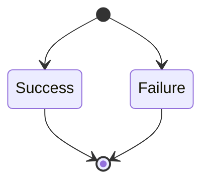
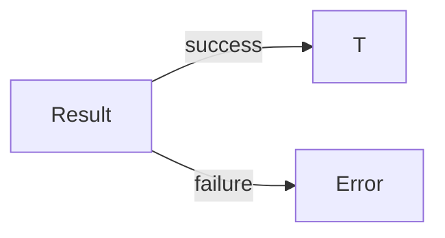
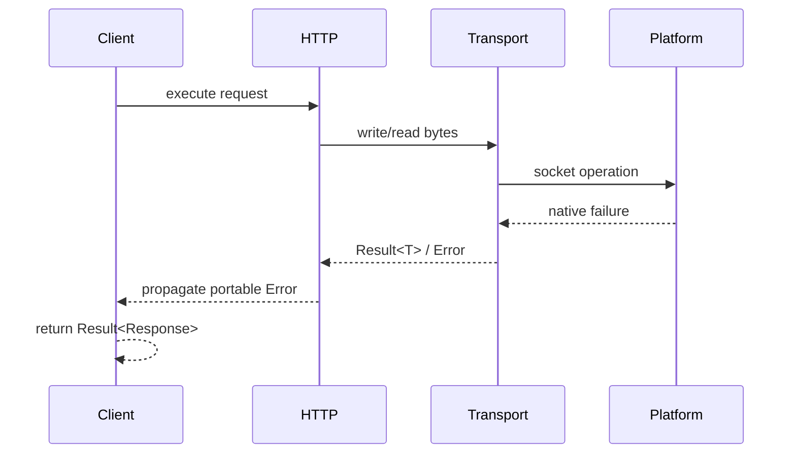

# `Result<T>` Contract

## Status

- Project: `cpp_request`
- Target release: MVP v1.0
- Status: Proposed v1 contract
- Language baseline: C++17

## Purpose

`Result<T>` is the standard return type for fallible public operations in `cpp_request`.

It represents exactly one of two states:

- success containing `T`, or
- failure containing `Error`.



A `Result<T>` must never represent both states simultaneously and must not require exception handling for expected network or protocol failures.

## Conceptual Public Interface

The public contract should support semantics equivalent to:

```cpp
template <class T>
class [[nodiscard]] Result {
public:
    bool has_value() const noexcept;
    explicit operator bool() const noexcept;

    T& value() &;
    const T& value() const &;
    T&& value() &&;

    Error& error() &;
    const Error& error() const &;
};
```

Construction/factory details may differ in implementation, but the success/failure semantics are frozen.

## `[[nodiscard]]`

`Result<T>` should be declared `[[nodiscard]]` so silently ignoring a potentially failed network operation produces a compiler diagnostic where supported.

Example:

```cpp
cpp_request::Client client;
client.get("http://example.com"); // should warn when result is discarded
```

## State Inspection

Two equivalent checks are permitted:

```cpp
if (result.has_value()) {
    // success
}

if (result) {
    // success
}
```

`operator bool()` must be `explicit` to avoid unintended arithmetic or implicit conversions.

## Value Access

`value()` is valid only when `has_value() == true`.

The v1 contract intentionally does not require `value()` to throw when called in the failure state.

Calling the wrong-state accessor is a programmer error and has a documented precondition.

This avoids imposing an exception-based access model on a library whose normal error handling is explicitly non-exception-based.

Recommended usage:

```cpp
auto result = client.get("http://example.com");
if (!result) {
    const auto& error = result.error();
    // handle error
    return;
}

const auto& response = result.value();
```

## Error Access

`error()` is valid only when `has_value() == false`.

Like `value()`, calling it in the opposite state violates the accessor precondition.

## Ownership

`Result<T>` owns whichever active state it contains.

Therefore:

- successful `Result<Response>` owns its `Response`,
- failed `Result<Response>` owns its `Error`,
- moving a result transfers its active state according to `T` / `Error` move semantics,
- copying is available only when the contained type permits it.

## Storage Representation

The exact physical storage is intentionally not part of the public API contract.

Acceptable implementation approaches may include:

- `std::variant<T, Error>`,
- manually managed discriminated storage,
- another zero-extra-allocation representation.

The implementation must be benchmarked/inspected before choosing a more complex custom representation solely for performance.

C++17 makes `std::variant` a valid baseline candidate and avoids unnecessary custom lifetime machinery during initial development.

## Allocation Policy

`Result<T>` itself must not require a separate heap allocation solely to store its success/error discriminator.

Any allocation performed by `T` remains a property of `T`, not of the result abstraction.

## `Result<void>`

Operations that can fail but do not naturally return a value may use a `Result<void>` specialization or an equivalent project-owned success type.

Conceptually:

```cpp
Result<void> operation();
```

The specialization must preserve the same state-inspection and `error()` semantics.

Exact implementation is deferred until a concrete internal/public operation needs it.

## No `ErrorCode::None` Requirement

Success is represented by the `Result` state itself, not by an `ErrorCode::None` sentinel.

This keeps the model explicit:



There is no valid state where a failure contains a "no error" code.

## Error Propagation

Internal functions should propagate failures without converting them to text and reparsing them later.

Example conceptual flow:



## Exception Boundary

`Result<T>` is responsible for expected operation failures, not catastrophic runtime conditions such as allocation failure.

The contract therefore distinguishes:

- expected network/protocol failures → `Result<T>` failure,
- programmer contract violations → accessor precondition violation,
- unrelated standard-library/system failures → not redefined by this result model.

## Non-Goals

For v1, `Result<T>` does not need to provide a large functional-combinator API such as:

- `and_then`
- `transform`
- `or_else`
- monadic pipelines

These may be added later if real usage demonstrates value. The initial API should stay small and focused.
