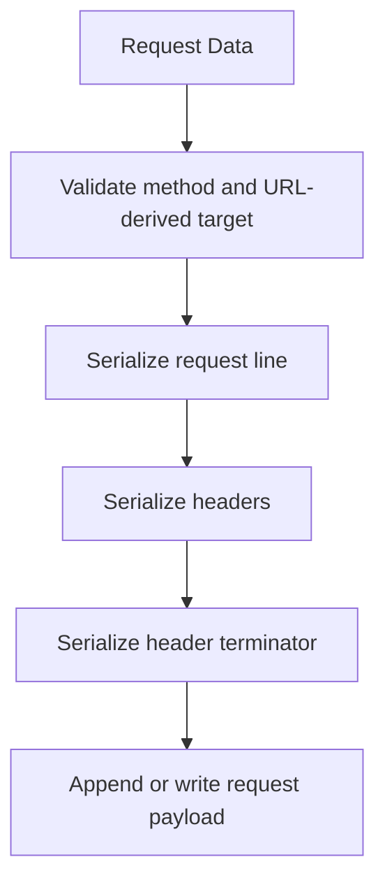
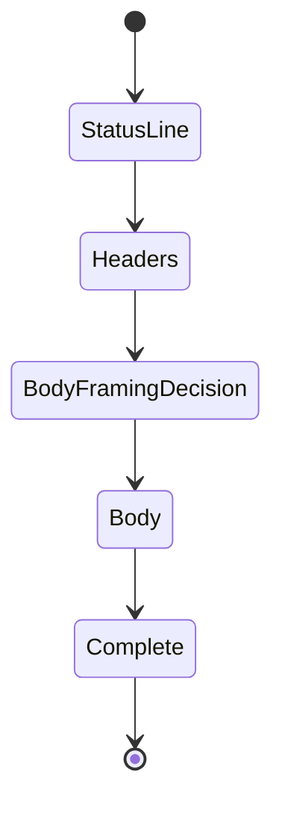

# HTTP Layer Architecture

## Purpose

The HTTP layer implements HTTP/1.1 request serialization and response processing while remaining independent from native socket APIs.

## Request Pipeline

The layer should avoid unnecessary intermediate copies. `std::string_view` may be used for non-owning request inputs when lifetime is guaranteed by the synchronous call boundary.

## Request Serialization

The serializer is responsible for producing valid HTTP/1.1 wire format, including:

- method token
- request target
- `HTTP/1.1`
- header field lines
- terminating CRLF sequence
- request body bytes when present

Automatically generated headers such as `Host` and `Content-Length` are added when required and not supplied explicitly.

For v1 request framing:

- caller-supplied `Transfer-Encoding` is rejected,
- duplicate `Host` is rejected,
- duplicate `Content-Length` is rejected,
- caller-supplied `Content-Length` must exactly match the in-memory body size,
- non-empty bodies receive an automatic `Content-Length` when absent,
- empty `POST`, `PUT`, and `PATCH` requests receive `Content-Length: 0`,
- empty `GET`, `HEAD`, and `DELETE` requests do not receive an automatic zero length.

## Response Processing

The response parser conceptually proceeds through states:

Malformed protocol data transitions to an error result instead of continuing with ambiguous state.

## Body Framing

The parser supports v1 framing rules for:

1. responses terminated by the header section because of request/status semantics,
2. `Transfer-Encoding: chunked`,
3. `Content-Length`,
4. connection-close-delimited bodies where required by HTTP/1.1 framing.

Framing precedence follows HTTP/1.1 semantics and unsafe ambiguity is rejected rather than guessed.

The v1 hardening policy is:

- responses to `HEAD` complete after the header section,
- `101`, `204`, and `304` are header-terminated responses,
- `1xx` responses other than `101` are interim and are consumed before the final response,
- framing fields on `1xx`/`204` responses are rejected,
- simultaneous `Transfer-Encoding` and `Content-Length` is rejected as conflicting framing,
- duplicate `Content-Length` fields are rejected rather than normalized,
- `304` and `HEAD` may carry representation-length/framing metadata while still having no response body,
- `205 Reset Content` is content-forbidden but not blindly treated as header-terminated: `Content-Length: 0` and zero-content chunked framing can complete on a persistent connection, while an unframed 205 is close-delimited and cannot be reused,
- any actual decoded/close-delimited content on a 205 is a malformed response.

This conservative policy prioritizes unambiguous message boundaries and connection-reuse safety.

## Chunked Decoder

The chunked decoder owns protocol state for:

- reading hexadecimal chunk size,
- parsing chunk extensions,
- consuming each chunk payload,
- validating CRLF framing,
- recognizing the terminal zero-size chunk,
- consuming and validating the trailer section,
- preserving bytes that belong to a following response.

Chunk extensions follow token / quoted-string syntax rather than accepting arbitrary printable bytes. Empty extension names, missing extension values, malformed quoted strings, invalid chunk sizes, and invalid data delimiters are rejected.

Trailer fields are syntax-validated and consumed but are not merged into the public response-header collection in v1. Framing-critical trailer fields such as `Content-Length` and `Transfer-Encoding` are rejected.

Decoded body bytes are accumulated into the v1 in-memory response body.

## Header Handling

Headers are parsed without requiring per-character heap allocation.

The architecture permits:

- case-insensitive header-name lookup,
- duplicate header fields where HTTP permits them,
- preserving sufficient response data for user-facing access.

Obsolete folded header lines and invalid field-name/value bytes are rejected.

## Timeout and EOF Semantics

Timeouts remain stage-specific:

- connect timeout bounds connection establishment across candidate endpoints,
- write timeout bounds the complete logical request transmission; segmented head/body writes share one deadline,
- read timeout bounds each wait for additional response data, acting as an inactivity/read-progress timeout rather than one deadline for the entire response.

EOF is interpreted only with HTTP framing context:

- incomplete `Content-Length` or chunked response at EOF is `UnexpectedEof`,
- a valid close-delimited response completes at EOF,
- a read timeout is not treated as EOF and therefore does not complete a close-delimited message.

## Connection Semantics

After a response is complete, the HTTP layer reports whether protocol semantics permit the underlying connection to remain reusable.

Reasons to reject reuse include:

- `Connection: close`,
- close-delimited framing,
- protocol upgrade,
- incomplete or malformed response framing,
- transport termination before required body completion,
- any parser state that leaves unread bytes ambiguous.

The `Client` additionally refuses reuse when parser pending bytes remain after a completed non-pipelined request.

## Redirect Semantics

Redirect handling is orchestrated above the low-level parser but uses parsed status and `Location` metadata from this layer.

The v1 redirect policy:

- respects the configured enable/disable option,
- enforces a finite redirect count,
- resolves relative locations,
- rejects redirects requiring unsupported HTTPS transport,
- applies the documented 301/302/303/307/308 method/body policy.

## Parser Design Principle

The parser supports incremental input from `read_some()` rather than assuming one receive call contains a complete status line, header block, chunk, or body.

This is required for correctness over TCP and also enables focused parser benchmarks independent of live network latency.
