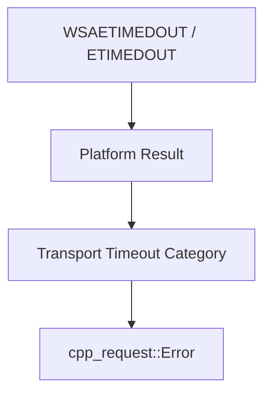

# Platform Socket Architecture

## Purpose

The platform layer isolates operating-system networking APIs from the transport and HTTP layers.

## Supported Backends

### Windows

The Windows backend uses Winsock2-compatible APIs.

Responsibilities include:

- process-level Winsock initialization where required
- native socket creation and destruction
- address resolution calls
- connect/send/recv operations
- socket option configuration
- retrieval of Winsock error values

### POSIX

The POSIX backend uses BSD/POSIX socket APIs suitable for Linux and compatible systems.

Responsibilities include:

- native socket creation and destruction
- address resolution calls
- connect/send/recv operations
- socket option configuration
- retrieval of `errno`-style diagnostics

## Isolation Rule

Platform headers such as Winsock or POSIX socket headers must remain inside implementation-facing boundaries whenever practical.

The supported public API must not require consumers to manipulate:

- `SOCKET`
- POSIX socket file descriptors
- `sockaddr`
- `addrinfo`
- platform-specific constants or error codes

## Native Socket Wrapper

An internal native socket wrapper should provide RAII ownership around a single handle.

Required semantics:

- invalid/default state is representable
- ownership is unique
- copy is disabled for owning state
- move transfers ownership
- destruction closes a valid handle
- explicit close leaves the wrapper invalid

No PImpl allocation is required.

## Error Normalization

The platform layer captures native diagnostics but does not expose them as the primary project error contract.

Example flow:

Native codes may still be retained as optional diagnostic metadata for debugging.

## Initialization Lifetime

Windows networking startup is a platform concern, not an HTTP concern.

The implementation should ensure that Winsock initialization is:

- performed before socket operations,
- cleaned up safely when appropriate,
- not repeatedly initialized per request without reason.

Exact startup ownership is deferred to implementation design, but it must not require user code to call `WSAStartup` directly.

POSIX platforms require no equivalent global startup API.

## Timeout Mechanisms

The platform layer provides the primitives needed by transport to enforce connect/read/write timeouts.

The architecture does not mandate one mechanism across all platforms. Implementations may use appropriate socket modes, polling/select-style APIs, or socket options provided that externally visible timeout semantics remain consistent.

## Portability Constraint

Linux-specific behavior must not leak into the common transport interface unless isolated behind a backend-specific path. The POSIX design should remain suitable for future macOS validation where practical.
