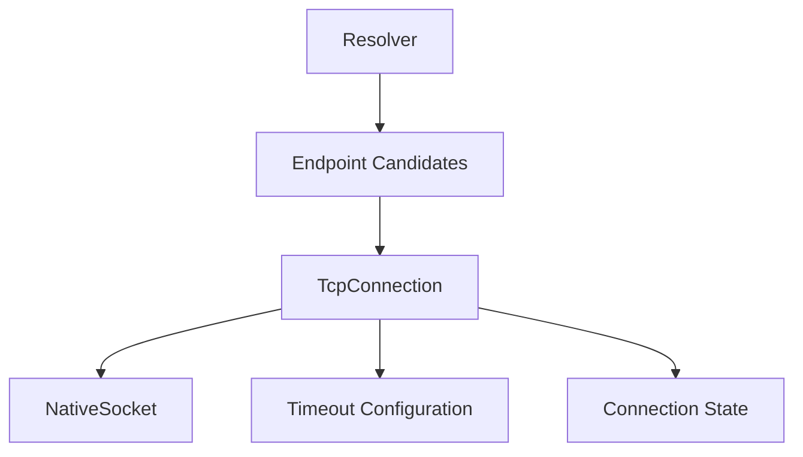

# Transport Architecture

## Purpose

The transport layer provides synchronous, byte-oriented TCP communication without knowing HTTP semantics.

## Core Responsibilities

- resolve hostnames into candidate endpoints
- attempt TCP connection establishment
- enforce connect timeout
- write complete byte sequences while handling partial sends
- read byte sequences while handling partial receives
- enforce read and write timeouts
- close invalid or non-reusable connections deterministically
- preserve enough endpoint identity to decide whether a connection can be reused

## Suggested Internal Components



Names are illustrative and are not yet public API commitments.

## Resolver

The resolver should:

- accept host and service/port information
- request both IPv4 and IPv6 candidates where supported
- return normalized endpoint candidates
- avoid exposing `addrinfo` as a public-library type
- preserve candidate ordering from the platform resolver unless a future policy explicitly changes it

Resolution failure maps to the project error model.

## TcpConnection

A connection owns one native socket handle or no handle.

Required behavior:

- non-copyable when owning a socket
- movable
- destructor closes an owned socket
- repeated `close()` is safe
- failed connect leaves the object in a valid non-connected state

The transport API should expose operations conceptually equivalent to:

```cpp
connect(endpoint, timeout)
write_all(data, timeout)
read_some(buffer, timeout)
close()
```

Exact public/internal signatures are deferred to the API design phase.

## Partial I/O

Native `send`/`recv` calls are not assumed to transfer the full requested amount.

`write_all` must continue until:

- all bytes are sent,
- timeout occurs,
- the peer fails/closes,
- or another unrecoverable transport error occurs.

Reading is incremental because HTTP framing determines how much data is eventually required.

## Timeouts

The architecture distinguishes three timeout categories:

- connect
- read
- write

A timeout must be reported distinctly from generic connection/send/receive failure.

Implementation may use platform-specific mechanisms internally, but timeout policy belongs to transport rather than HTTP parsing.

## Connection Reuse

Transport owns the connection object, while the HTTP layer determines protocol eligibility for reuse.

A connection is reusable only when all of the following are true:

- transport still considers the socket connected/usable,
- the HTTP layer has fully consumed the current response,
- HTTP semantics do not require closure,
- the next request targets a compatible endpoint.

For v1, `Client` may retain simple reusable connection state. A generalized multi-host connection pool is out of scope.

## Endpoint Compatibility

At minimum, connection reuse must not occur across incompatible host/port pairs.

Because HTTPS is out of scope in v1, transport identity does not yet include TLS session/configuration state.

## Error Boundary

Platform-specific numeric errors may be retained for diagnostics, but transport exposes library-owned error categories upward.

Examples:

```text
name resolution failed
connection failed
connect timeout
read timeout
write timeout
send failed
receive failed
connection closed
```

The final taxonomy is defined separately from this architecture document.
